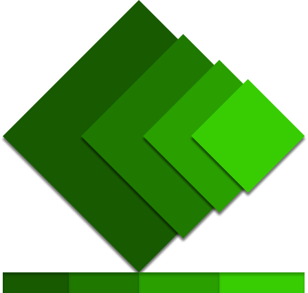
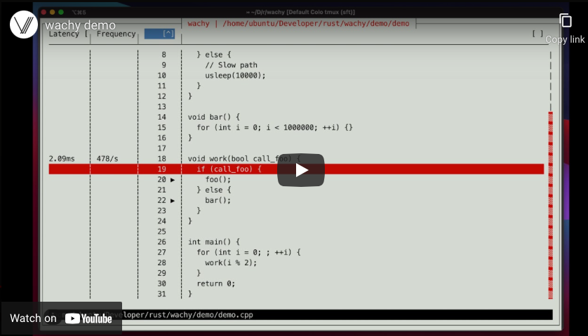

# <!--fit-->  Wachy Internals

## An overview of wachy's implementation

<!--
A presentation to cover a few different aspects of wachy. Goal is to help others
get familiar with the architecture and contribute (or at least know where to
look) if necessary.
-->

---

# Background

Problem statement: most perf debugging tools
 - Focus on on-CPU debugging; waiting on mutex / IO / network does not show up
 - Stack-sampling based and thus can only show aggregates
 - Tracing tools require code modifications to work => tradeoff between
   debuggability and performance

---

# Background

<div class="center">

[](https://www.youtube.com/watch?v=8Pwy-J4e4sQ "Demo video")

For more details on usage see the [guide](docs/guide.md).

</div>

---

# High Level Ideas

 - Written in Rust
 - Key libraries:
    - `cursive`, `cursive_table_view` - TUI
    - `object`, `addr2line` - examine object files/executables, debugging symbols
    - `zydis` - x86/x64 decoder
 - Event-driven programming (required by `cursive`)

---

# High Level Ideas

 - Rust requires single ownership. This becomes interesting with event-driven
   programming where state may need to be used in different event handlers.
 - Solution: `Cursive` object is available in every handler,
   `cursive::user_data` can store a single object of any type. We place all
   state into a single class (`Controller`).

---

# Class Structure

<div class="mermaid">
%%{init: {'themeVariables': { 'fontSize': '25px'}}}%%
graph TD;
    Controller --> Program;
    Controller --> Views;
    Controller <-- events --> Search;
    Controller <-- events --> TraceStack;
    TraceStack --> BpftraceProgram;
    TraceStack --> Tracer;
    Tracer -- parse --> TraceStack;
    Tracer -- events --> Controller;
</div>

Program - parse binaries, ELF/DWARF information, decode the assembly. E.g. find
the source file/line number for a particular function.

---

# Class Structure

<div class="mermaid">
%%{init: {'themeVariables': { 'fontSize': '25px'}}}%%
graph TD;
    Controller --> Program;
    Controller --> Views;
    Controller <-- events --> Search;
    Controller <-- events --> TraceStack;
    TraceStack --> BpftraceProgram;
    TraceStack --> Tracer;
    Tracer -- parse --> TraceStack;
    Tracer -- events --> Controller;
</div>

Views - functions to help manage and create cursive views. Uses existing cursive
views to actually store the view state.

---

# Class Structure

<div class="mermaid">
%%{init: {'themeVariables': { 'fontSize': '25px'}}}%%
graph TD;
    Controller --> Program;
    Controller --> Views;
    Controller <-- events --> Search;
    Controller <-- events --> TraceStack;
    TraceStack --> BpftraceProgram;
    TraceStack --> Tracer;
    Tracer -- parse --> TraceStack;
    Tracer -- events --> Controller;
</div>

Search implements async fuzzy search in a separate thread. Ensures we don't
block main TUI thread.

---

# Class Structure

<div class="mermaid">
%%{init: {'themeVariables': { 'fontSize': '25px'}}}%%
graph TD;
    Controller --> Program;
    Controller --> Views;
    Controller <-- events --> Search;
    Controller <-- events --> TraceStack;
    TraceStack --> BpftraceProgram;
    TraceStack --> Tracer;
    Tracer -- parse --> TraceStack;
    Tracer -- events --> Controller;
</div>

TraceStack - maintains state on what needs to be traced. Per the video, we
maintain a stack rather than just individual functions. Has logic to convert it
to a `bpftrace` expression.

---

# Class Structure

<div class="mermaid">
%%{init: {'themeVariables': { 'fontSize': '25px'}}}%%
graph TD;
    Controller --> Program;
    Controller --> Views;
    Controller <-- events --> Search;
    Controller <-- events --> TraceStack;
    TraceStack --> BpftraceProgram;
    TraceStack --> Tracer;
    Tracer -- parse --> TraceStack;
    Tracer -- events --> Controller;
</div>

BpftraceProgram - represents a simple AST. Constructed by TraceStack, and
serialized into a `bpftrace` expression.

---

# Class Structure

<div class="mermaid">
%%{init: {'themeVariables': { 'fontSize': '25px'}}}%%
graph TD;
    Controller --> Program;
    Controller --> Views;
    Controller <-- events --> Search;
    Controller <-- events --> TraceStack;
    TraceStack --> BpftraceProgram;
    TraceStack --> Tracer;
    Tracer -- parse --> TraceStack;
    Tracer -- events --> Controller;
</div>

Tracer - handles actually running a (single instance of) `bpftrace`, and parsing
the output to generate appropriate events for the Controller to update TUI.

---

# Startup

Let's go over what happens when wachy is started on a binary
(`wachy demo/demo work`):
1. `Program` is initialized with path `demo/demo`. Various internal information
   based on the binary is setup to enable efficient lookups.
2. `Controller` is initialized with `program` object and search term `work`.

---

# Startup

3. Searches through all symbols/functions in the binary to find matches of
   `work`, lets user pick if there are multiple.
4. Once the user picks a function, looks up the source code location (file/line
   number) for it.
5. Opens the file path and reads the source code.
6. Looks up and decodes the assembly to find all call instructions in that
   function.

---

# Startup

7. For each call instruction, notes down the
   [call type](#enter-push-line-onto-stack), relative instruction offset, and
   corresponding source code location.
8. Displays source code view, focused on the line corresponding to `work` and
   with `▶` on lines with call instructions.

---

# Startup

9. Sets up `TraceStack` and `Tracer` for `work`, which starts a `bpftrace`
   program in the background.

   We'll walk through a simplified version of the `bpftrace` generated program
   (assuming some familiarity with `bpftrace` syntax, and removing some cruft
   that is not relevant for this example).

---

# Startup

<style scoped> pre { font-size: 20px; } </style>
```c
BEGIN {
  @start_time = nsecs;
  @depth[-1] = 0;
}
uprobe:/home/ubuntu/Developer/rust/wachy/demo/demo:_Z4workb /@depth[tid] == 0/ {
  @start18[tid] = nsecs;
  @depth[tid] = 1;
}
uretprobe:/home/ubuntu/Developer/rust/wachy/demo/demo:_Z4workb /@depth[tid] == 1/ {
  @depth[tid] = 0;
  @duration18 += (nsecs - @start18[tid]);
  @count18 += 1;
  delete(@start18[tid]);
}
interval:s:1 {
  printf("{\"time\": %d, \"lines\": {", (nsecs - @start_time) / 1000000000);
  printf("\"18\": [%lld, %lld]", @duration18, @count18); printf("}}\n");
}
```

<!--
`@depth` keeps track of the current thread's depth of the matching stack.
`uprobe` and `uretprobe` are used to probe function entry and exit,
respectively. Each trace has an associated ID which is currently just the line
number (since we only allow one trace per line at the moment). For each trace,
we maintain a cumulative duration `@duration<id>` and count `@count<id>`.

Every second, we print the info so far in a JSON format.
-->

---

# Output

Example output of the `bpftrace` program:
```
{"time": 1, "lines": {"18": [993835300, 472]}}
```
This is parsed by `TraceStruct` into Rust struct `TraceInfo`. An event is sent
into a channel to pass it to `Controller`, which then updates the TUI
appropriately.

---

# Interactive Changes

Now, let's consider what happens when a user modifies a trace - by pressing
<kbd>x</kbd> to trace the current line:
1. The event handler for <kbd>x</kbd> is defined in `Controller::add_callbacks`
   (initialized during startup).
2. If there are multiple calls on the current line, lets user pick which one to
   trace.

---

# Interactive Changes

3. Calls `TraceStack::add_callsite` to add the callsite to be traced.
4. `TraceStack` updates internal members and fires an event
   `TraceCommandModified`.
5. In the next event loop, `Controller` receives the event and calls
   `Tracer::rerun_tracer`.
6. This in turn sends a `TraceCommand::RerunTracer` event.

---

# Interactive Changes

7. It is received by a separate thread polling on this channel, which calls
   `libc::kill` on the `bpftrace` pid. The thread that was processing `bpftrace`
   stdout is joined.
8. A new `bpftrace` command is run, and a new thread spawned to process its
   stdout.

---

# Questions?
